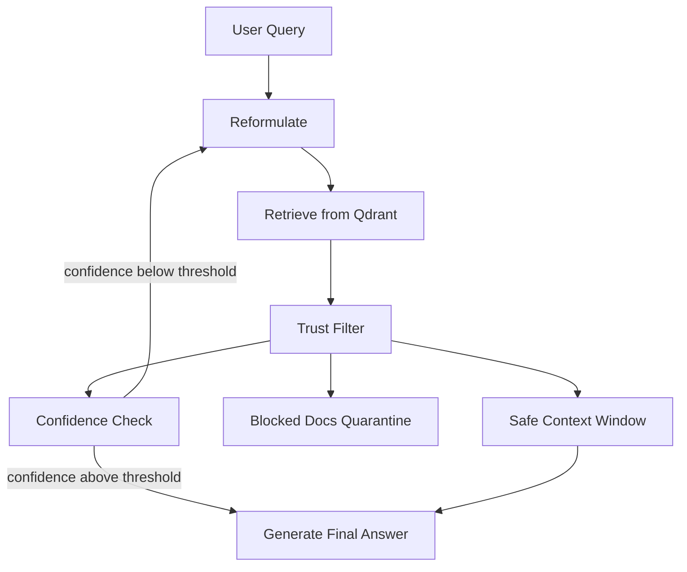

# SecureStep-RAG

SecureStep-RAG is a hardened iterative retrieval-augmented generation (RAG) system designed to resist adversarial prompt injection attacks during multi-hop retrieval.

## Key Features

- LangGraph stateful loop with secure hop control.
- Trust filter that combines semantic, source, injection, and cross-hop consistency scores.
- Adversarial attack simulation modules (cascade, drift, corpus poisoning).
- Guardrails on input, retrieval chunks, and output.
- Ablation framework comparing defense stacks.

## Architecture



## Core Pipeline State

The pipeline state carries:

- `query`
- `hop_count`
- `context_window` (trusted docs only)
- `blocked_docs` (quarantine log)
- `hop_queries` (history per hop)

## Install

```bash
poetry install
cp .env.example .env
```

## Run

```bash
make run
```

## Index Documents

```bash
python benchmark/build_dataset.py
make index
```

## Attack Simulation

```bash
make attack
python attack/cascade_attack.py
python attack/drift_attack.py
```

## Evaluation

```bash
make eval
```

This runs four conditions:

1. no_attack
2. attack_no_defence
3. attack_trust_filter_only
4. attack_trust_filter_plus_rails

and reports:

- RAGAS-style faithfulness
- attack success rate
- blocked doc count

## Testing

```bash
make test
```

## Docker

```bash
make docker
```

Services:

- Qdrant (`6333`)
- Redis (`6379`)
- FastAPI app (`8000`)

## Project Layout

```text
securestep-rag/
├── pipeline/
├── trust_filter/
├── attack/
├── guardrails/
├── models/
├── vector_store/
├── eval/
├── benchmark/
├── configs/
├── tests/
├── notebooks/
├── pyproject.toml
├── .env.example
├── docker-compose.yml
├── Makefile
└── README.md
```
